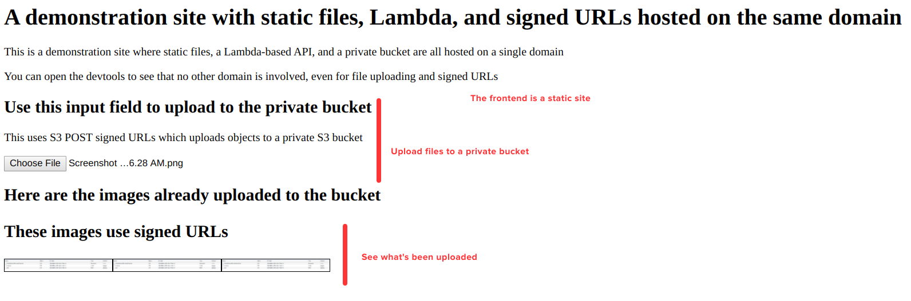
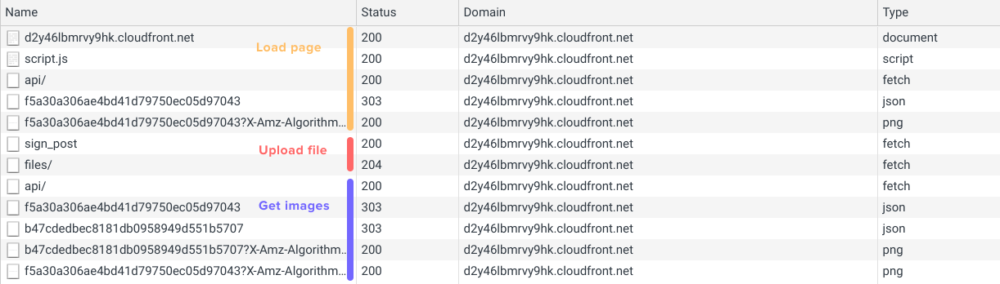

# Demonstration code to show how static files, a serverless API, and upload/download signed URLs can be served on a single domain with CloudFront

This stack brings 3 things under one roof using CloudFront:

* A static website, stored in an S3 bucket
* A Lambda function behind an API Gateway
* A private bucket that can be used to upload and download files with signed URLs

The path structure is this:

* ```/``` => The static website
* ```/api/``` => The lambda function
* ```/files/``` => The private bucket

## How to deploy

* ```terraform init```
* ```terraform apply```
* open the resulting URL

## How to clean up

* ```terraform destroy```
* wait until tomorrow
* ```terraform destroy```

Yep, the stack uses Lambda@Edge which is built on replicating the function on the edge locations and those are cleaned up after a few hours of deleting the CloudFront distribution.

That's why [you'll get an error message first](https://advancedweb.hu/how-to-use-lambda-edge-with-terraform/#destroying) but then it will succeed.

## How to use

Upon opening the page, you'll see some instructions. There are 2 interesting parts of the page:

* The file input which can be used to upload images to the private bucket
* and the images list on the bottom of the page that shows all the uploaded images



### Single domain

Opening the devtools reveals why this stack is important: all the requests are going to the same domain, even though there are quite a few services are working together.
Even the uploads are sent to CloudFront which routes them to the private bucket.


